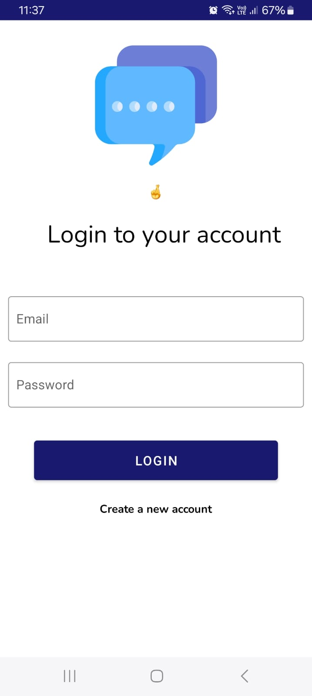

**🚀 Overview**  

ChatRTC is a real-time chat application built using Android (Java/Kotlin) and Firebase. It provides a seamless chatting experience with features like user authentication, real-time messaging, and profile management.  

---

### 📱 Features  

✅ Firebase Authentication (Email/Password, Google Sign-In)  
✅ Real-Time Messaging (Powered by Firebase Firestore/Database)  
✅ User Profiles (Profile picture, Display name)  
✅ One-on-One Chat  
✅ Typing Indicators & Read Receipts (Optional)  
✅ Push Notifications (Using Firebase Cloud Messaging)  
✅ Secure Data Handling  

---

### 🛠 Tech Stack  

- **Language:** Kotlin  
- **Architecture:** MVVM (Model-View-ViewModel)  
- **Database:** Firebase Firestore  
- **Authentication:** Firebase Auth  
- **Cloud Messaging:** Firebase Cloud Messaging (FCM)  
- **UI:** Material Design  

---

### 🔧 Installation & Setup  

1. **Clone the repository:**  

   ```bash
   git clone https://github.com/your-username/ChatRTC.git
   cd ChatRTC
   ```

2. Open the project in **Android Studio** and sync **Gradle**.  

3. **Setup Firebase:**  
   - Create a Firebase project at **Firebase Console**.  
   - Add the `google-services.json` file to the `app/` directory.  
   - Enable Authentication (**Email/Password, Google Sign-In, etc.**).  
   - Setup **Firestore or Realtime Database**.  

4. **Run the app** on an emulator or device!  

---

## 📸 Screenshots

| **Login** | **Signup** | **Home Interface** | **Chat Interface** |
|:---:|:---:|:---:|:---:|
|  |  |  |  |
---

### **🤝 Contributing**  

We welcome contributions to improve **ChatRTC**!  

#### How to Contribute:  
1. **Fork the repository.**  
2. **Create a new branch:**  
   ```bash
   git checkout -b feature-branch
   ```
3. **Make changes & commit:**  
   ```bash
   git commit -m "Added a new feature"
   ```
4. **Push to GitHub:**  
   ```bash
   git push origin feature-branch
   ```
5. **Create a Pull Request** and describe your changes.  

🙌 Feel free to report bugs, suggest enhancements, or contribute to the documentation!  

---
